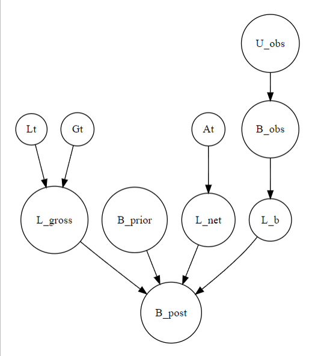
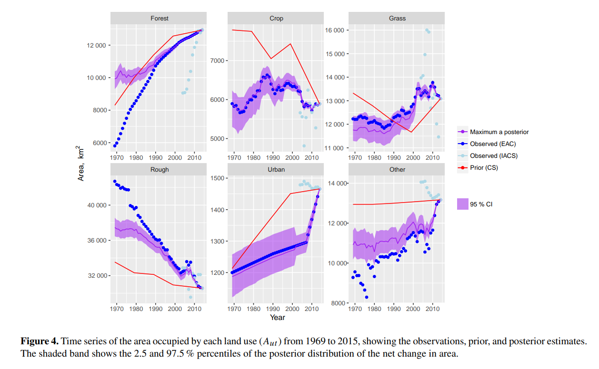

# Introduction

This document outlines the Bayesian framework described in **Levy et al. (2018)**: *"Estimation of Gross Land-Use Change and Its Uncertainty Using a Bayesian Data Assimilation Approach" (Biogeosciences, 15(5), 1497-1513)*. The paper introduces a novel approach for estimating land-use change by addressing the challenge of having multiple sources of land-use maps of an area. By employing a Bayesian framework, these diverse sources are treated as prior information, which is then assimilated to generate a more refined and cohesive land-use map.

The Bayesian framework was applied to what the authors refer to as **data assimilation**, which they define as: *"An approach for fusing observations with prior knowledge (e.g., mathematical representations of physical laws; model output) to obtain an estimate of the distribution of the true state of some phenomenon."*

The research question of this paper is:

> How can a Bayesian model be developed and applied to integrate multiple data sources to produce accurate estimates of land-use change pattern over time?

For ease of reference, all equations and figure numbers mentioned in this document correspond directly to those in the original publication instead of going in order.

# Model Description

## Data Structure

We begin with historical land use maps, denoted as $\mathbf{U}$, which represent land use types at each grid location on the map. Each grid location is specified by coordinates $x$ and $y$, making $\mathbf{U_{xy}}$ a vector that describes land use at a particular location. By utilizing maps from multiple time points, we can construct a land use transition matrix, $\mathbf{B}$, for each time step $t$.

The land use transition matrix $\mathbf{B}$ is defined as:

$$
B = 
\begin{bmatrix}
0 & \beta_{12} & \beta_{13} & \dots & \beta_{1n} \\
\beta_{21} & 0 & \beta_{23} & \dots & \beta_{2n} \\
\vdots & \vdots & \vdots & \ddots & \vdots \\
\beta_{n1} & \beta_{n2} & \beta_{n3} & \dots & 0
\end{bmatrix}
\quad t=1
$$

$$
\vdots
$$

$$
\begin{bmatrix}
0 & \beta_{12} & \beta_{13} & \dots & \beta_{1n} \\
\beta_{21} & 0 & \beta_{23} & \dots & \beta_{2n} \\
\vdots & \vdots & \vdots & \ddots & \vdots \\
\beta_{n1} & \beta_{n2} & \beta_{n3} & \dots & 0
\end{bmatrix}
\quad t=n_t
$$

where each $\beta_{ij}$ element represents the area of land use class $i$ (rows) that transitioned to class $j$ (columns) at time step $t$, measured in square kilometers (km^2^).

To calculate $\beta_{ijt}$, we use data from $\mathbf{U_{xy}}$:

$$
\beta_{ijt} = \sum_{x=1}^{n_x} \sum_{y=1}^{n_y} \left[ U_{xyt-1} = i \land U_{xyt} = j \right] l^2 \tag{3}
$$

where $l$ denotes the grid size of the map. By knowing these variables, we can express the net change in land use $\Delta A_{ut}$ using the net area difference:

$$
\Delta A_{ut} = A_{ut} - A_{ut-1} \tag{2}
$$

Alternatively, we can calculate $\Delta A_{ut}$ using the transition matrix $\mathbf{B}$ by determining the gross gains (column sum vector, $\mathbf{G_t}$) and the gross losses (row sum vector, $\mathbf{L_t}$):

$$
\Delta A_{ut} = G_{ut} - L_{ut} \tag{4}
$$

where

$$ G_{ut} = \sum_{i=1}^{n_u} \beta_{iut} \quad \text{and} \quad L_{ut} = \sum_{j=1}^{n_u} \beta_{ujt} $$

Knowing the parameters of $\mathbf{U}$, $\mathbf{B}$, and $\mathbf{A}$, the authors did two step of methods:

1.  The authors first applied the **Bayesian approach** to estimate the parameters in $\mathbf{B}$. In this framework, we specify prior information about $\mathbf{B}$ and use the likelihood based on partial observations of $\mathbf{U}$ and $\mathbf{A}$. This results in a posterior distribution for $\mathbf{B}$.

2.  The authors then use this posterior distribution of $\mathbf{B}$ along with a probability weighting matrix $\mathbf{W}$ to conduct a **weighted sampling operation**. This process simulates where land-use changes are likely to occur, generating posterior realizations of $\mathbf{U}$.

## Estimating posterior distribution of transition matrix

This part explains the different data source used in the Bayesian data assimilation framework. To know the details about each of the data source used, refer to Table 1 of the original publication.

### The Priors

The priors are derived from data provided by the Countryside Survey (CS), which provides direct observations of $\mathbf{B}$ over multiple years. This data is used as the prior of the framework in form of a matrix of $\mathbf{B^{prior}}$.

### The Observations

1.  The Agricultural Census (AC) provided the total area in the agricultural land use, which is one out of six land use category being analyzed in this paper. This data is then can be used as the $\mathbf{A_{ut}^{obs}}$ . By using the information from $\mathbf{B^{prior}}$ into $Eq. 4$ and combining different $t$ observation years, $\Delta \mathbf{A_{ut}^{obs}}$ could be gained.

2.  The EDINA Agricultural Census (EAC) provided the detailed information of the $\mathbf{L_t}$ and $\mathbf{G_t}$.

3.  The $\mathbf{U^{obs}}$ matrices are derived from Corine, IACS, and FC maps. $\mathbf{U^{obs}}$ matrices serve as inputs for $Eq. 3$, which then produces $\mathbf{B_{t}^{obs}}$, the observed transition matrix for each year.

### The Likelihoods

These multiple data sets were being used by the authors to develop each of the likelihood based on the each observation variables.

1.  Using the $\Delta \mathbf{A_{ut}^{obs}}$ information, $\mathcal{L_{net}}$ was established, which is the likelihood based on the overall area change that follows a normal distribution:

$$\mathcal{L}_{net} = \prod_{u=1}^{n_u} \prod_{t=1}^{n_t} \frac{1}{\sigma_{ut}\sqrt{2\pi}} \exp \left( -\frac{(\Delta A_{ut}^{obs} - \Delta A_{ut}^{pred})^2}{2 \sigma_{ut}^2} \right) \tag{5}$$

with $\sigma_{ut}$ being the observational error of the data and $\Delta A_{ut}^{pred}$ is the prediction from $Eq. 4$ for the change in land use $u$ at time $t$

2.  Using the $\mathbf{G}$ and $\mathbf{L}$, the likelihood of the gross area change ($\mathcal{L_{gross}}$) can be calculated, however because of the nature of the data, the likelihood distribution is corrected using a skew parameter, making this a skewed normal distribution

$$\mathcal{L}_{gross} = \prod_{u=1}^{n_u} \prod_{t=1}^{n_t} \frac{2}{\sigma_{L_{ut}}^{obs}} \phi \left( \frac{L_{ut}^{obs} - L_{ut}^{pred}}{\sigma_{L_{ut}}^{obs}} \right) 
\Phi \left( \alpha \frac{L_{ut}^{obs} - L_{ut}^{pred}}{\sigma_{L_{ut}}^{obs}} \right) 
\times \frac{2}{\sigma_{G_{ut}}^{obs}} 
\phi \left( \frac{G_{ut}^{obs} - G_{ut}^{pred}}{\sigma_{G_{ut}}^{obs}} \right) 
\Phi \left( \alpha \frac{G_{ut}^{obs} - G_{ut}^{pred}}{\sigma_{G_{ut}}^{obs}} \right) \tag{6}$$

where $\phi$ is the standard normal probability density function, $\Phi$ is the corresponding cumulative density function, and $\alpha$ is the skew parameter.

3.  Using $\mathbf{B_{t}^{obs}}$, a likelihood of the predicted transition matrix ($\mathcal{L}_{B}$) can be calculated as follow:

$$
\mathcal{L}_{B} = \prod_{i=1}^{n_u} \prod_{j=1}^{n_i} \prod_{t=1}^{n_t} \frac{1}{\sigma_{\beta_{ijt}}^{\text{obs}} \sqrt{2\pi}} \exp \left( -\frac{\left( \beta_{ijt}^{\text{obs}} - \beta_{ijt}^{\text{pred}} \right)^2}{2 \left( \sigma_{\beta_{ijt}}^{\text{obs}} \right)^2} \right) \tag{7}
$$

A joint likelihood function is developed by summing each of the log-likelihoods.

### JAGS model

While the authors did not provide specific code to demonstrate the analysis process, they mentioned using the `BayesianTools` package rather than running the analysis with `rjags`. However, the simplified framework of the model in `rjags` might look as the following:

```{r, tidy=TRUE, tidy.opts=list(width.cutoff=60)}
# Some variables needed to be define before (such as the prediction variables) but not included in this script example

model_dummy <- "
model {
  ### PRIORS ###

  # B_prior represents prior B matrix for land use transitions from CS data.
  for (i in 1:n_u) { # n_u is the total number of land use classes
    for (j in 1:n_t) { # n_t is the number of timesteps
      B[i, j] ~ dnorm(B_prior[i, j], tau_B) # tau_B is the precision (inverse of variance)
    }
  }

  # Prior for observational error was not explained in the publication, but it's necessary to define it
  # Assuming standard deviations (sigma) are within range [x1, x2]
  sigma_A ~ dunif(x1, x2)  
  sigma_L ~ dunif(x1, x2)  
  sigma_G ~ dunif(x1, x2)

  # Calculate precisions (tau = 1/sigma^2)
  tau_A <- 1 / (sigma_A^2)
  tau_L <- 1 / (sigma_L^2)
  tau_G <- 1 / (sigma_G^2)

  ### LIKELIHOOD ###

  # Likelihood for net area change (delta_A_obs follows a normal distribution)
  for (u in 1:n_u) {
    for (t in 1:n_t) {
      delta_A_obs[u, t] ~ dnorm(delta_A_pred[u, t], tau_A)
    }
  }

  # Likelihood for gross area change (L_obs and G_obs follow skewed normal distributions)
  for (u in 1:n_u) {
    for (t in 1:n_t) {
      L_obs[u, t] ~ dsnorm(L_pred[u, t], tau_L, alpha_L) # alpha_L is the skewness parameter
      G_obs[u, t] ~ dsnorm(G_pred[u, t], tau_G, alpha_G) # alpha_G is the skewness parameter
    }
  }

  # Likelihood for transition matrix (beta_obs follows a normal distribution)
  for (i in 1:n_i) { # n_i is the t-1 land use class
    for (j in 1:n_j) { # n_j is the t land use class
      for (t in 1:n_t) { # n_t is the time step
        beta_obs[i, j, t] ~ dnorm(beta_pred[i, j, t], tau_B)
      }
    }
  }

  # Overall likelihood: summation of individual log-likelihoods (not explicitly elaborated)
}
"

```

After defining the model, we can proceed with fitting it to the observation data. To simplify the process, the observation data is stored in a list object containing the map information (might need to be converted to matrix format). This list object is named `data_input`. According to the article, the model used nine chains with 100,000 iterations each.

The initial $B$ parameter values for one chain were established using a least-squares fit with $\Delta{A}$, while the other chains were over-dispersed by adding random variation to this best-fit parameter set. We could define this information specifically in the `jags.model` parameters, but to keep things simple, as the same concept with the inputs, the initial values of the iterations can be defined as stored as an object which in this case is called `inits_list`.

```{r, eval = FALSE}
library(rjags)
model <- jags.model(textConnection(model_dummy), 
                    data = data_input, 
                    inits = inits_list, 
                    n.chains = 9
                    )

```

We then apply the MCMC sampling to the model with 100,000 iterations to establish the posterior distribution of $B^{post}$

```{r, eval = FALSE}
samples <- coda.samples(model, 
                        variable.names = c("B_post"), 
                        n.iter = 100000)
```

::: {.callout-note appearance="simple"}
***Why did the authors chose this parameters to run the MCMC?***

The parameters were used to explore the parameter space and get a robust convergence considering the highly dimensional data. One chain was initialized with a least-squares fit while others were over dispersed with random variations to explore a broader range of possibilities. For example, this setup helps the sampler avoid getting stuck in local modes and accurately estimate complex posterior distributions.
:::

## Updating the land cover with the posterior transition matrix

After obtaining $\mathbf{B^{post}}$, the authors had the information of each land use change area allocation from class $i$ to $j$ for each time step $t$ . Using this information, then used the $\mathbf{U^{obs}}$ from $t$ and $t-1$ to allocate cell grids that are being sampled for each transition from $i$ to $j$. The rule of the sampling is represented as follow:

$$
\begin{aligned}
    W_{xy} &\leftarrow 
    \begin{cases} 
        0, & \text{if } U_{xy,t}^{obs} \neq i \\ 
        1, & \text{else} 
    \end{cases} \\
    W_{xy} &\leftarrow 
    \begin{cases} 
        1, & \text{if } U_{xy,t-1}^{obs} = j \\ 
        p_m, & \text{else} 
    \end{cases}
\end{aligned}
$$

with $p_{m}$ being the probability of cells being mis-classified in $U^{obs}$ .

::: callout-tip
### Example of weighted sampling operation

It is known from the $\mathbf{B^{post}}$ that seven grid cells change from grass to crop from 2014 to 2015. The model selects candidate cells that are crop in 2015, with a higher probability given to the same cells that were grass in 2014. If the posterior estimate $\beta_{ijt}^{post}$ (the predicted area of change from crop to grass) is smaller than the observed value $\beta_{ijt}^{obs}$, only a subset of the high-probability cells will be selected. The process results in the number of cells that most likely to change are those identified as crops in 2015 and as grass in 2014, based on the weighting criteria $\mathbf{W}$.
:::

The method to conduct weighted sampling is not elaborated in this report, but could be done in R with different packages available. The result of this part will also not be evaluated furthermore in the next sections.

## Directed Acyclic Graphs (DAG)

In the original publication, Figure 2 presents a schematic diagram illustrating how each dataset contributes to the assimilation process. The simplified structure of this Bayesian data assimilation application is represented as the following DAG

```{r, fig.align = 'center', out.width = "35%", echo=FALSE}

```

```{r, echo=FALSE, include=FALSE}
# DAG using Diagrammr

library(DiagrammeR)

grViz("
  digraph BayesianLinearModel {
    graph [layout = dot, rankdir = UD]

    Lt [label = 'Lt', shape = circle]
    Gt [label = 'Gt', shape = circle]
    At [label = 'At', shape = circle]
    Uobs [label = 'U_obs', shape = circle]
    Bprior [label = 'B_prior', shape = circle]
    Lgross [label = 'L_gross', shape = circle]
    Lnet  [label = 'L_net', shape = circle]
    Lb  [label ='L_b', shape = circle]
    Bobs  [label = 'B_obs', shape = circle]
    Bpost [label = 'B_post', shape = circle]
    # Wt  [label = 'W_t', shape = circle]
    # Upost [label = 'U_post', shape = circle]
    

    Lt -> Lgross
    Gt -> Lgross
    At -> Lnet
    Uobs -> Bobs
    Lgross -> Bpost
    Lnet -> Bpost
    Bobs -> Lb
    Lb -> Bpost
    Bprior -> Bpost
    # Uobs -> Upost
    # Bpost -> Upost
    # Wt -> Upost
  }
")
```

# Results

**MCMC result:** Although not shown, the authors ran several convergence diagnostics and mentioned that the MCMC converged, providing a reasonable estimate of the posterior distribution of B.

```{r, fig.align = 'center', out.width = "50%", echo=FALSE}

```

Figure 4 reveals diverse patterns in how the total change of area results differ across changes based on the posterior distribution $\beta_{ij}$ (in Fig. 5 in the article, not shown here), compared with the prior distribution. The change differences are subjected to the inconsistencies of the quality of information given by the prior and observation for each of the land use change categories. Generally, in case where the prior and data observation has different quality of information, the posterior pattern will tend to follow the pattern of the data that has better quality of information (less variance). For example, in the grassland area dynamic, the IACS data shows high variance, resulting in posterior predictions that align more closely with EAC (that has better information) while still reflecting trends from the CS prior.

```{r, fig.align = 'center', out.width = "45%", echo=FALSE, fig.show='hold'}
knitr::include_graphics(c("bayesian_final_project_files/figures/fig_6.png","bayesian_final_project_files/figures/fig_7.png"))
```

Figures 6 and 7 show the total area gained and lost for each land use. The same observations can be inferred as in Figure 4, where each class has its own variability. One factor that can explain these variations between classes is the difference in how each observation data set categorizes land use classes and they need to be re-classified, however this reclassification process is not always resulting in the best result. For example, because urban and other land-use categories are not define in most of the raw data, they have fewer data points, which means the posterior is less constrained. In urban areas, this lack of data causes the posterior to show general trends instead of detailed changes.

All the figures show variations in the 95% credible intervals across change categories, with wider intervals generally indicate higher uncertainty. In this land use change model, uncertainty is defined from the model's ability to balance one land use change with others. Predictions where an observed change in one land use isn't compensated by changes in others lead to higher uncertainty. Conversely, narrow credible intervals indicates all the different source of observations data consistently agree on the change pattern.

# Advantages

In the discussion section, the authors highlight the advantages of using a Bayesian approach over previous methods, which relied on regression relationships. Specifically, the Bayesian approach maximizes the use of various sources of information derived from historical data to predict the locations where land-use changes are most likely to occur. Unlike regression models, the Bayesian framework explicitly acknowledge the uncertainties in the posterior distributions of transition matrices ($\mathbf{B}$) and predictions of area change ($\mathbf{A}$).

The authors also mentioned another advantage of this approach: adding additional data sources (as prior) is possible without changing any major changes in the pipeline process. This advantage would be useful for the suggestion in the following Suggestions section.

# Limitations

One significant challenge noted in the paper is the issue of **observational error**, which arises due to the varying and often poorly documented methodologies used in gathering the observation data. As the authors state, "*If the observational error and prior are correctly specified and the posterior is adequately characterized by the MCMC sampling, then the posterior correctly represents the actual state of knowledge about the system parameters and prediction.*" This means that the success of the Bayesian method depends on accurately defining the errors and prior distributions. Moreover, the data used in the study varied in terms of detail and reliability. Nevertheless, the Bayesian framework addresses these uncertainties by effectively down-weighting less accurate data sources, such as IACS data, which may conflict with more reliable national-scale trends (e.g., AC data), during the computation of the posterior distribution $\mathbf{B^{post}}$.

# Model Improvement Suggestion

A key assumption of the model is that land use transitions follow a constant transition matrix over time. This implies that the patterns of land use change are expected to adhere to predictable rules. However, in reality, land use changes are often driven by external factors. For example, the probability of deforestation may increase if access to forests becomes easier due to infrastructure development. Therefore, including such explanatory variables (e.g., the Euclidean distance map from the road network) into the model could improve the accuracy of the predictions in real-life situations. This approach of integrating anthropogenic maps is commonly used in other land use change prediction models, such as in this study: (link [here](https://doi.org/10.1016/j.scitotenv.2021.152348))

# Future Direction

The authors mentioned how this framework could also be used to simulate future land use changes, rather than retroactively predicting past changes. In this study, the authors used a single posterior matrix to generate the predicted land use matrix, $\mathbf{U^{post}}$. However, it is theoretically possible to use the newly generated $B$ matrix as prior information in each iteration (sequential Bayesian updating). This would allow the model to incorporate the most up-to-date information at each step. However, this approach would be computationally intensive and could result in the accumulation of uncertainty over time with each successive iteration.

Another potential solution is to introduce regularization techniques to control uncertainty propagation, or to use a hierarchical Bayesian model that can better acknowledge uncertainties at different levels of the modeling process.

# Implementation to Other Scientific Context

Beyond generating land use maps, this Bayesian data assimilation approach could also be applied in other cases where multiple information sources serve as possible priors for conducting inference. One example is predicting how species and ecosystems will respond to climate change, which often requires large-scale datasets from a variety of sources. These datasets can include satellite imagery, ground observations, climate projections, and ecological models of species interactions. However, these data sources are often inconsistent, noisy, or sparse. The challenge is to combine these different sources of information while accounting for uncertainties in both the observations and the models.
